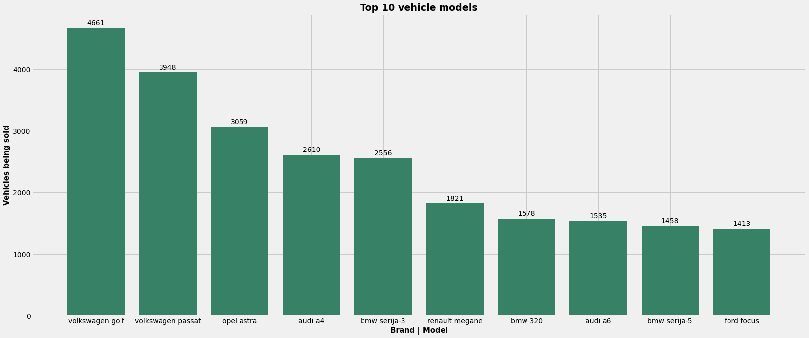

# Serbia's used cars market analysis, visualized
Being interested in which used cars and brands are sold the most in Serbia, I've decided to write an web scraper that'll extract the amount of ads for each brand, and in it, each model and while at it, I found that visualizing it would be good way to have something that can be updated and taken look at every few months. So in future, changes to the market could be tracked and visualized just by re-running the scripts.

## The process:
I decided to obtain the data from a popular site for used vehicles in Serbia - [polovniautomobili.com](https://www.polovniautomobili.com) ; So the first part of the project involved writing a scraper script.
On the site there are 81 brands and 1129 models in total and the scraper needed to visit all models of each respective brand.
That data is saved to an .csv file, which is later read and manipulated with help of **Pandas**. After that, based on different criteria, it is visualized using **Matplotlib**.

## Some of the visualized examples from data, by amount of current vehicles selling...

<ul>
  <li>Top 10 brands as lines with numbers: </li>
  
  <li>Same, but now as circle graph with procentages:  </li>
  
  <li>Top 10 models in of Top 10 brands: </li>
  
  <li>Top 10 models out of all brands:  </li>
  
  <li>Top 10 brands share compared all other brands: </li>
  </ul>

